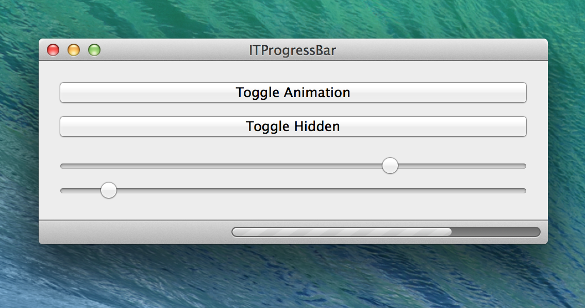
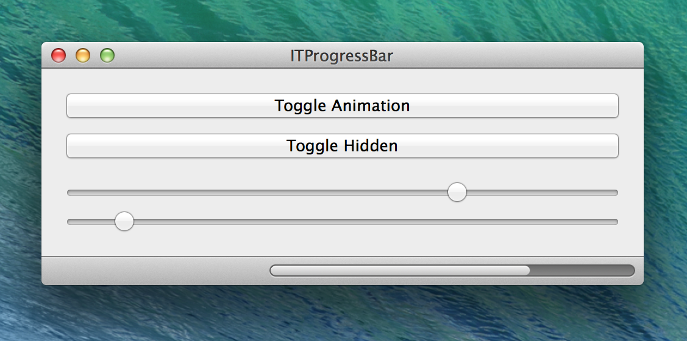
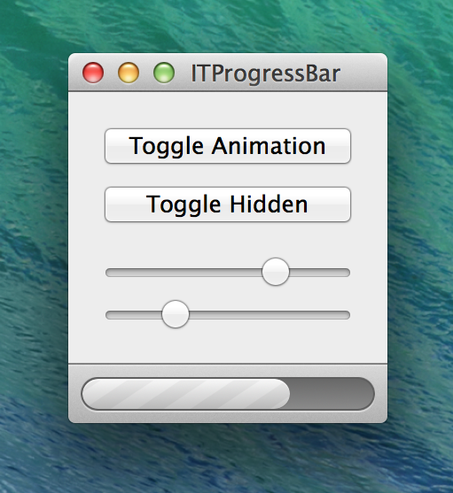

ITProgressBar
=============

`ITProgressBar` is a high-performance progress bar control for Mac OS X.
It’s implemented using Core Animation, making it lighning-fast.

### Documentation

Check out the demo-project and the `ITProgressBar.h` file to learn more about the control.

Lazy-ass you say? You might just be right.

### License

    DO WHAT THE FUCK YOU WANT TO PUBLIC LICENSE 
    Version 2, December 2004 
    
    Copyright (C) 2013 Ilija Tovilo <support@ilijatovilo.ch> 
    
    Everyone is permitted to copy and distribute verbatim or modified 
    copies of this license document, and changing it is allowed as long 
    as the name is changed. 
    
    DO WHAT THE FUCK YOU WANT TO PUBLIC LICENSE 
    TERMS AND CONDITIONS FOR COPYING, DISTRIBUTION AND MODIFICATION 

    0. You just DO WHAT THE FUCK YOU WANT TO.